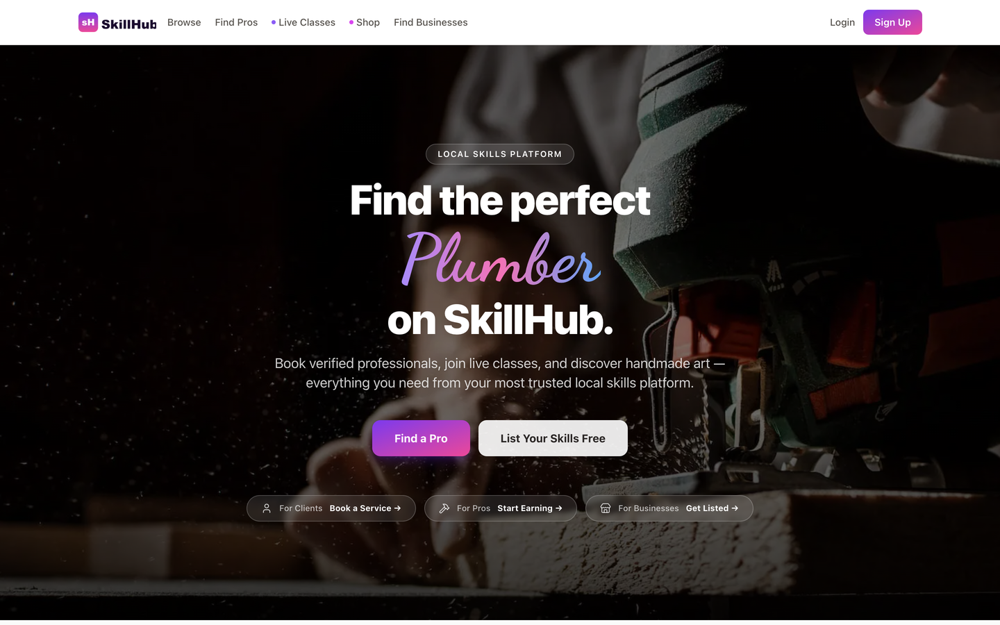
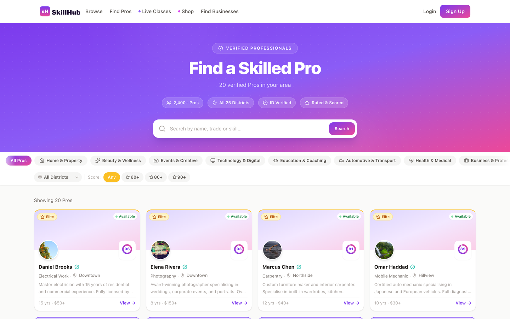
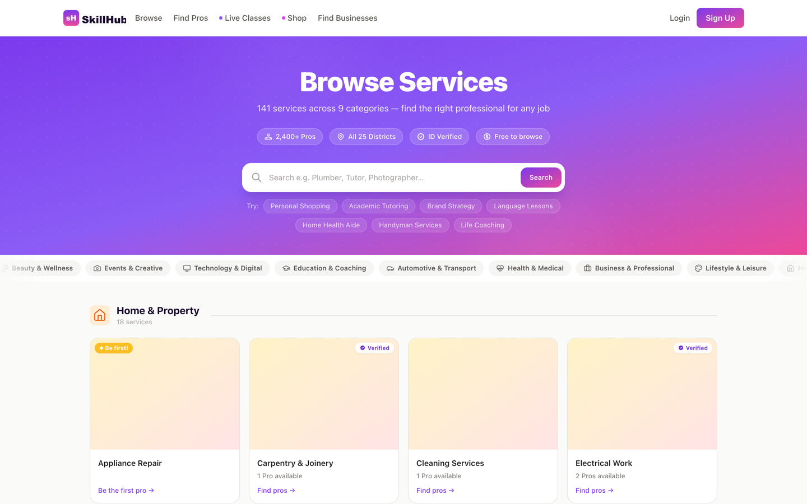
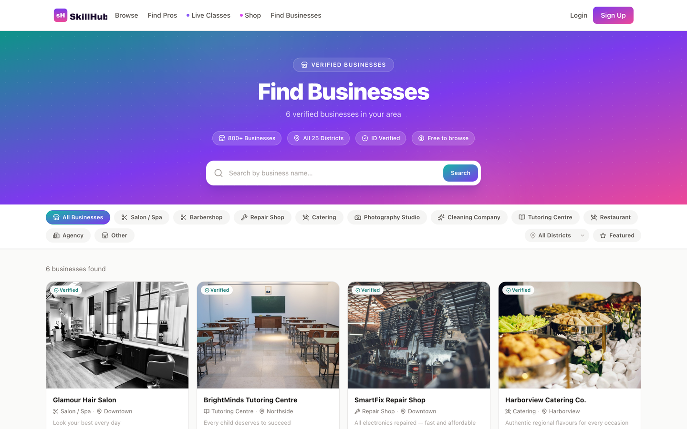
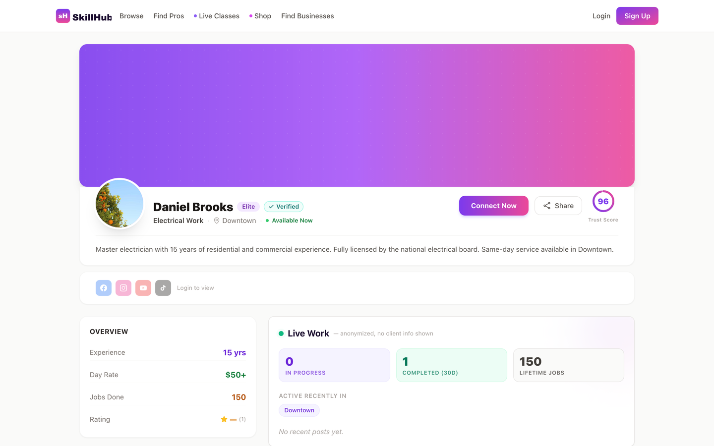
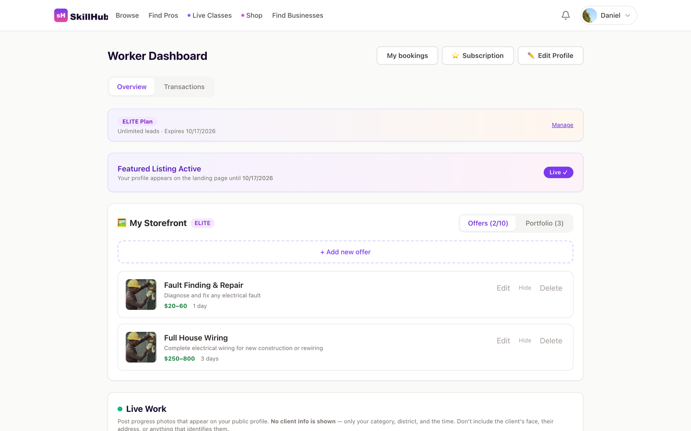
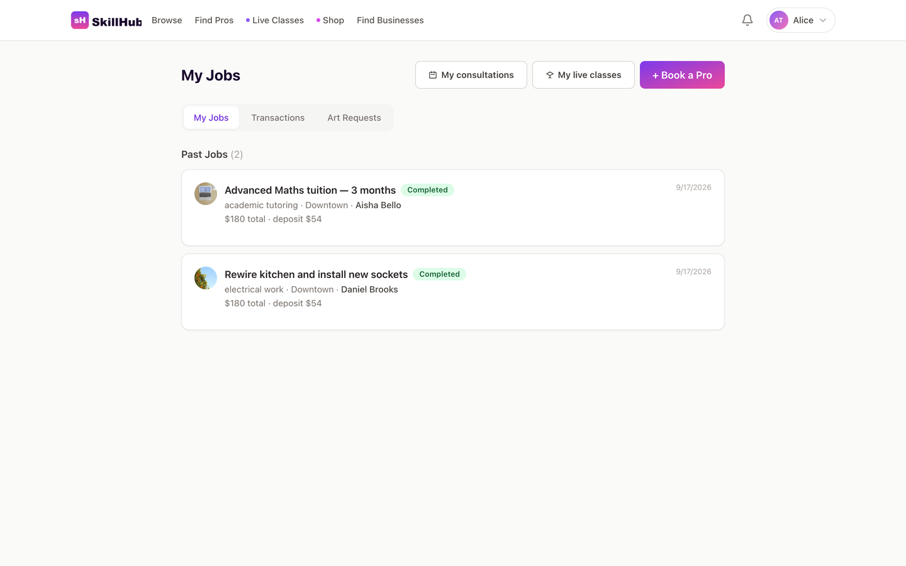
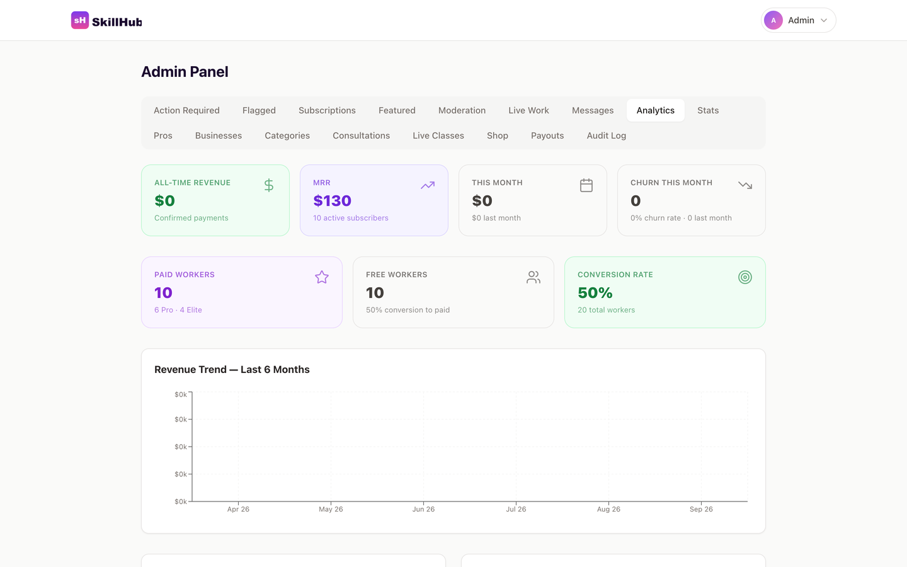
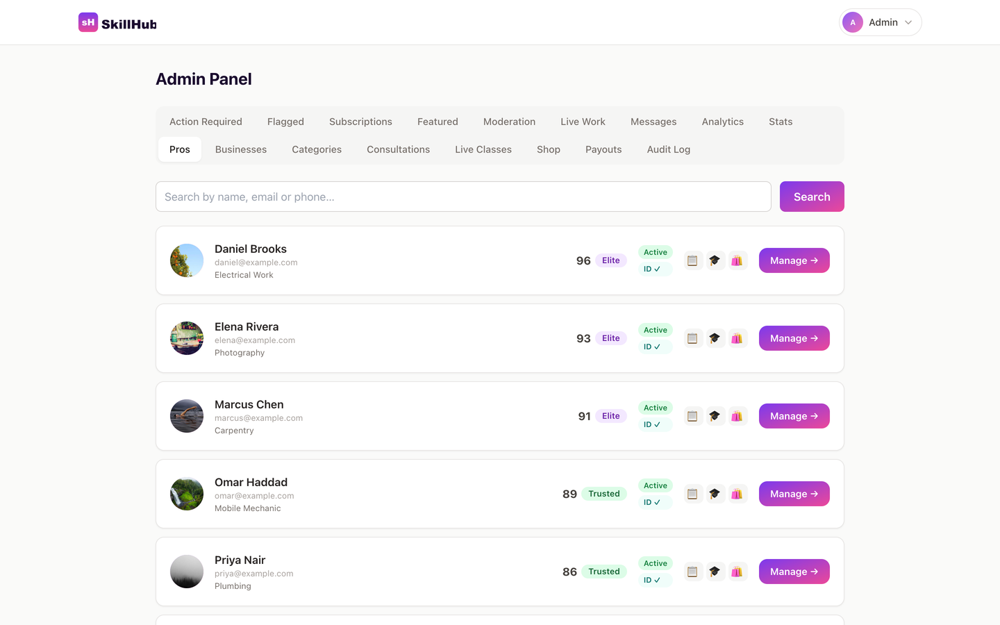

<div align="center">

# SkillHub

**An open-source, full-stack local services marketplace.**

Clients find and book verified professionals and businesses. Professionals get a
scored public profile, subscription tiers, live classes, paid consultations and a
storefront. Admins moderate, resolve disputes and configure commissions.

React · Vite · Tailwind · Node · Express · MongoDB · Stripe · LiveKit


**Production code, not a tutorial project** — this powers a live services
marketplace with real clients, real professionals and real payments.
Released free for anyone to use.

</div>

---

> **Shared as-is, and not actively maintained.** It is complete and it works,
> but I am not developing it further. Fork it and make it yours — issues and
> pull requests may not get a response. No warranty, no support, no obligations
> either way.

> **This is a reference implementation.** Names, branding, regions, seed data,
> currency, plan prices and legal copy are deliberately generic placeholders.
> Everything brand- or locale-specific lives in two files —
> [`client/src/config/site.js`](client/src/config/site.js) and
> [`server/config/site.js`](server/config/site.js) — both driven by environment
> variables. See [docs/CONFIGURATION.md](docs/CONFIGURATION.md).
>
> The legal pages (`/terms`, `/privacy`) are **sample text, not legal advice**.
> Have a lawyer review them before you operate a real marketplace.

## Contents

- [What it does](#what-it-does)
- [Screenshots](#screenshots)
- [Tech stack](#tech-stack)
- [Quick start](#quick-start)
- [Project layout](#project-layout)
- [Documentation](#documentation)
- [Optional integrations](#optional-integrations)
- [Contributing](#contributing)
- [Licence](#licence)

## What it does

### Three account roles

| Role | Can do |
|------|--------|
| **Client** | Browse and search Pros/businesses, post jobs, book consultations, enrol in live classes, buy from Pro storefronts, rate work, raise disputes |
| **Pro** (worker) | Onboard with ID verification, manage a scored profile and portfolio, receive leads, sell consultations and live classes, run a shop, request payouts, subscribe to a plan |
| **Business** | Register a company profile with services, photos and opening hours; subscribe to a plan |
| **Admin** | Moderate profiles and bios, verify IDs, resolve disputes, approve subscriptions and payouts, set commissions, manage categories, read the audit log |

### Core features

- **Trust score** — a 0–100 composite recomputed on every job event: completion
  rate (30%), Bayesian time-decayed client ratings (25%), responsiveness (20%),
  dispute record (15%) and trust signals (10%). Unverified Pros are capped at 70.
  Bands: Elite 90+, Trusted 75–89, Rising 55–74, Probation 35–54, Suspended ≤34.
  See [docs/ARCHITECTURE.md](docs/ARCHITECTURE.md#trust-score), or
  [docs/diagrams/](docs/diagrams/) for the same thing in four figures.
- **Escrow-style job flow** — 30% deposit on start, the balance released only on
  client confirmation, with a dispute path an admin resolves.
- **Subscriptions** — Free / Pro / Elite tiers gating leads, portfolio size,
  offer cards, storefront and search priority. Payments are submitted manually
  and verified by an admin.
- **Live classes & consultations** — scheduled video sessions over LiveKit, paid
  via Stripe, with automatic reminders and commission splits.
- **Pro storefront** — list items or take custom commissions, with platform fee
  handling and payout requests.
- **Commission engine** — platform default, per-category, per-Pro override and
  volume tiers, resolved in priority order per transaction type.
- **Social previews** — server-rendered Open Graph tags at `/render/*` for
  scrapers that do not run JavaScript.
- **Internationalisation** — i18next with a data-driven locale registry; English
  ships, and adding a language is a JSON file plus one array entry.

## Screenshots

There is no hosted demo — see [docs/DEMO.md](docs/DEMO.md) if you want to stand
one up. Everything below is the app running against the seeded database, which
you can reproduce locally in about five minutes with the
[quick start](#quick-start).

|  |  |
|---|---|
| **Landing page**<br> | **Browse professionals**<br> |
| **Service categories**<br> | **Business directory**<br> |
| **Professional profile**<br> | **Pro dashboard**<br> |
| **Client dashboard**<br> | **Admin analytics**<br> |
| **Admin — manage pros**<br> | |

## Tech stack

**Frontend** — React 18, Vite 5, TailwindCSS 3, React Router 6, TanStack Query 5,
Zustand, React Hook Form + Zod, Recharts, i18next, Stripe.js, LiveKit components.

**Backend** — Node 18+, Express 4, Mongoose 8, JWT (access + refresh), bcryptjs,
Helmet, express-rate-limit, express-validator, Multer, Cloudinary, Agenda
(job queue), node-cron, Nodemailer, Stripe, LiveKit server SDK.

## Quick start

**Prerequisites:** Node.js 18 or newer, npm, and a MongoDB instance
(local `mongod`, Docker, or a free MongoDB Atlas cluster).

```bash
git clone <your-fork-url> skillhub
cd skillhub
```

### 1. Backend

```bash
cd server
npm install
cp .env.example .env
```

Fill in the three required values in `server/.env`:

```bash
MONGO_URI=mongodb://localhost:27017/skillhub
JWT_SECRET=<paste a random string>
JWT_REFRESH_SECRET=<paste a different random string>
```

Generate the secrets with:

```bash
node -e "console.log(require('crypto').randomBytes(48).toString('hex'))"
```

Then start it:

```bash
npm run dev          # http://localhost:5000, restarts on change
```

Every other integration (Stripe, Cloudinary, LiveKit, SMTP, SMS) is optional and
degrades gracefully — e-mails and SMS print to the console, uploads fall back to
local disk, and payment endpoints return a clear error.

### 2. Frontend

```bash
cd ../client
npm install
cp .env.example .env.local
npm run dev          # http://localhost:5173
```

The Vite dev server proxies `/api` and `/uploads` to `http://localhost:5000`, so
you can leave `VITE_API_URL` blank in development.

### 3. Seed demo data

```bash
cd ../server
npm run reseed       # wipes the database, then seeds users, categories and groups
```

This creates 20 Pros, 6 businesses, 5 clients, jobs in every state, and an admin.

**Demo credentials**

| Role | E-mail | Password |
|------|--------|----------|
| Admin | `admin@skillhub.example.com` | `Admin123!` |
| Pro | `daniel@example.com` | `password123` |
| Client | `alice@example.com` | `password123` |

Every seeded account uses `password123` except the admin. **Change these before
deploying anywhere public.**

Open <http://localhost:5173> and sign in.

## Project layout

```
.
├── client/                  React + Vite frontend
│   ├── public/              Static assets (favicon, robots.txt, sitemap.xml, OG image)
│   └── src/
│       ├── components/      Shared UI (cards, badges, forms, video, i18n switcher)
│       ├── config/site.js   ← All branding, locale and region configuration
│       ├── hooks/           Data-fetching hooks
│       ├── lib/             Axios instance with JWT refresh, category helpers
│       ├── locales/         i18next translation JSON
│       ├── pages/           Route components, grouped by role
│       │   ├── admin/       Admin panel
│       │   ├── business/    Business onboarding + dashboard
│       │   ├── client/      Client dashboard
│       │   └── worker/      Pro onboarding, dashboard, shop, classes, subscription
│       └── store/           Zustand stores (auth, notifications)
│
└── server/                  Node + Express API
    ├── config/
    │   ├── site.js          ← All branding, locale and CORS configuration
    │   └── plans.js         Subscription tiers and manual payment channels
    ├── middleware/          JWT auth, role guard, file upload
    ├── models/              21 Mongoose schemas
    ├── routes/              17 route modules mounted under /api
    ├── seeds/               Database seeding and migration scripts
    ├── services/            Score, commission, availability, payments, video,
    │                        e-mail, SMS, audit, moderation flags, job queue
    └── utils/               Slug helpers
```

## Documentation

| Document | Covers |
|----------|--------|
| [docs/CONFIGURATION.md](docs/CONFIGURATION.md) | Every environment variable, how to rebrand, change currency, regions, time zone and locales |
| [docs/ARCHITECTURE.md](docs/ARCHITECTURE.md) | Data model, auth flow, trust score, commission resolution, money flow, background jobs |
| [docs/API.md](docs/API.md) | Response envelope, auth, rate limits, and every endpoint |
| [docs/DEPLOYMENT.md](docs/DEPLOYMENT.md) | Production build, PM2, nginx, webhooks, hardening checklist |
| [docs/DEMO.md](docs/DEMO.md) | Hosting a public demo: free-tier services, demo mode, scheduled resets, costs |
| [docs/diagrams/](docs/diagrams/) | How the trust score works, explained in four figures |
| [CONTRIBUTING.md](CONTRIBUTING.md) | Development workflow and code conventions |
| [SECURITY.md](SECURITY.md) | Reporting vulnerabilities, and what this codebase does and does not protect |

## Optional integrations

| Integration | Needed for | Without it |
|-------------|-----------|------------|
| **Stripe** | Consultations, live classes, shop checkout | Those endpoints return an error; the rest of the app works |
| **Cloudinary** | Hosted image uploads | Falls back to local disk under `server/uploads/` |
| **LiveKit** | Video rooms for classes and consultations | Sessions can be booked but not joined |
| **SMTP** | Password resets and notification e-mails | E-mails print to the server console |
| **SMS gateway** | Booking and reminder texts | Messages print to the server console |
| **Unsplash** | `npm run seed:images` category covers | Seeding runs without cover images |

Set them up in [docs/CONFIGURATION.md](docs/CONFIGURATION.md#optional-integrations).

## Contributing

This project is shared as-is and is not actively maintained, so pull requests
may sit unreviewed. You are very welcome to fork it and take it in your own
direction — that is what it is here for.

If you do want to contribute back, [CONTRIBUTING.md](CONTRIBUTING.md) describes
the conventions the codebase follows.

## Licence

[MIT](LICENSE) — covers the **code**. Use it, fork it, ship it commercially. No
warranty.

### A note on the bundled images

The photographs in `client/src/img/` and the Unsplash URLs referenced by the
seed scripts are **placeholders**, and the MIT licence above does not grant you
any rights to them. Before you deploy publicly, replace them with images you own
or are licensed to use. The generated logo, favicon and OG image are trivial
originals — replace them anyway, with your own brand.
