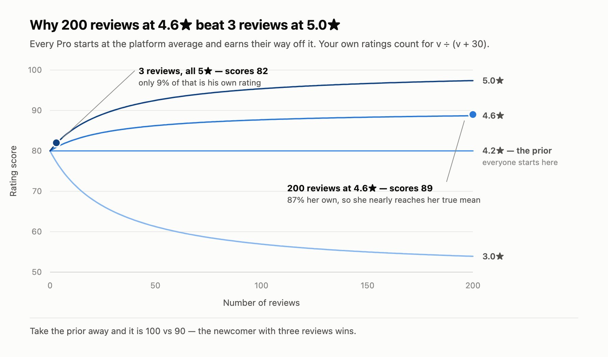
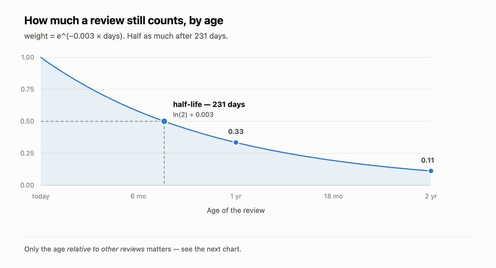
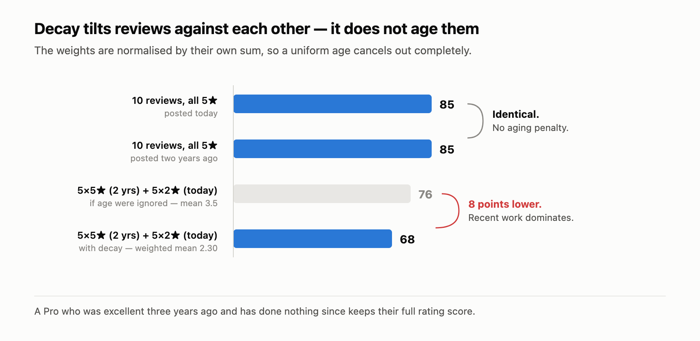
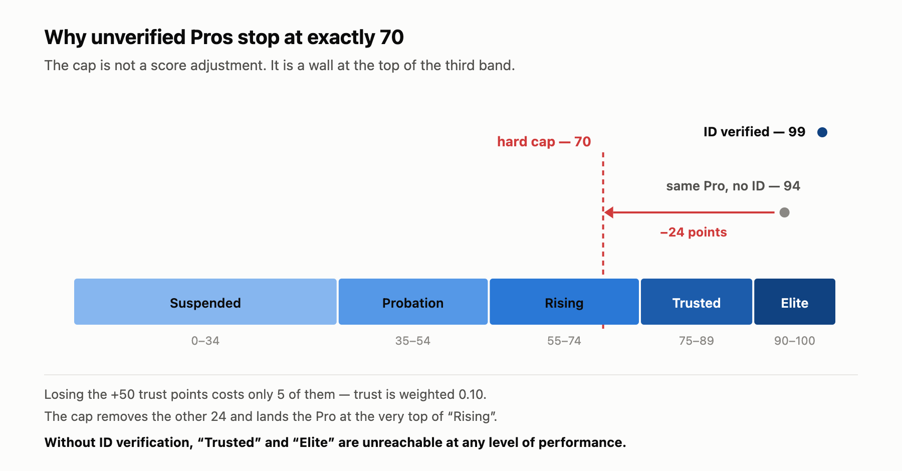

# Trust score diagrams

Four figures explaining the scoring in
[`server/services/scoreService.js`](../../server/services/scoreService.js).
Each is generated directly from the constants in that file, so if you change
them the diagrams are wrong until you regenerate.

Both `.svg` (editable vector) and `.png` (900px wide, 2× for retina) are
provided. Use the PNGs for platforms that will not render SVG; the SVGs scale.

The numbers behind every figure are tabulated below, so nothing here is locked
inside an image.

## The constants

```js
const PLATFORM_MEAN_RATING = 4.2;    // the prior — what we assume before evidence
const BAYESIAN_THRESHOLD   = 30;     // how many reviews the prior is "worth"
const DECAY_LAMBDA         = 0.003;  // per day
```

---

## 1. Bayesian shrinkage



```
bayesianAdj = (v × weightedMean + 30 × 4.2) / (v + 30)
ratingScore = ((bayesianAdj − 1) / 4) × 100
```

A weighted average between the Pro's own mean and the platform mean, where the
platform is held with the weight of 30 reviews. Your share of the result is
`v / (v + 30)`.

| Reviews | Your data | Prior |
|--------:|----------:|------:|
| 1 | 3% | 97% |
| 3 | 9% | 91% |
| 10 | 25% | 75% |
| **30** | **50%** | **50%** |
| 100 | 77% | 23% |
| 200 | 87% | 13% |

Resulting score, by true mean:

| Reviews | 5.0★ | 4.6★ | 4.2★ | 3.0★ |
|--------:|-----:|-----:|-----:|-----:|
| 0 | 80 | 80 | 80 | 80 |
| 3 | 82 | 81 | 80 | 77 |
| 10 | 85 | 83 | 80 | 73 |
| 30 | 90 | 85 | 80 | 65 |
| 100 | 95 | 88 | 80 | 57 |
| 200 | 97 | 89 | 80 | 54 |

The 4.2★ line is flat because 4.2 *is* the prior — there is nothing to shrink
toward. Everyone starts at 80 and earns their way off it.

**The headline comparison:** 3 reviews at 5.0★ scores **82**; 200 reviews at
4.6★ scores **89**. Without the prior it would be 100 vs 90 and the newcomer
would win.

Note how weak the signal is at low volume: three 1★ reviews still scores 73,
only nine points below three 5★ reviews. Ratings barely move the number until
roughly 30 jobs.

---

## 2. Time decay



```js
weight = Math.exp(-0.003 * daysAgo(job.createdAt))
```

| Age | Weight |
|----:|-------:|
| today | 1.00 |
| 90 days | 0.76 |
| **231 days** | **0.50** |
| 1 year | 0.33 |
| 2 years | 0.11 |

Half-life is `ln(2) / 0.003` = **231 days**, a little over seven months.

---

## 3. Decay is relative, not absolute



This is the part that is easy to get wrong. The weights are normalised by their
own sum:

```js
weightedMean = Σ(rating × weight) / Σ(weight)
```

If every review is the same age, the decay factor appears in both the numerator
and the denominator and **cancels out completely**.

| Scenario | Score |
|---|---:|
| 10 × 5★, posted today | 85 |
| 10 × 5★, posted two years ago | **85 — identical** |
| 5 × 5★ (2 yrs) + 5 × 2★ (today), if age were ignored | 76 |
| 5 × 5★ (2 yrs) + 5 × 2★ (today), with decay | **68** |

So old ratings do not fade. Decay only tilts reviews *against each other* — it
makes recent work outweigh old work when a Pro has both. A Pro who was excellent
three years ago and has done nothing since keeps their full rating score.

### A known inconsistency

`v` is `ratedJobs.length` — the raw count. It never decays, even though the
ratings it weighs do. So the confidence term and the value term disagree about
how much old evidence is worth:

| Age of 200 × 5★ reviews | As implemented | If `v` used the decayed weight |
|---|---:|---:|
| today | 97 | 97 |
| 1 year | 97 | 94 |
| 3 years | 97 | 84 |
| 5 years | 97 | 81 |

Mathematically the effective sample size should be `Σ(weight)` — about 2 after
five years, not 200. Fixing it is a one-line change:

```js
const v = weightSum;   // instead of ratedJobs.length
```

It is left as-is here because changing it would silently re-rank every existing
profile. Decide deliberately before you flip it.

---

## 4. The verification cap



```js
if (!user || !user.idVerified) {
  skillScore = Math.min(skillScore, 70);
}
```

| Pro | Score | Band |
|---|---:|---|
| Flawless, ID verified | 99 | Elite |
| Same Pro, no ID, before the cap | 94 | Elite |
| Same Pro, no ID, after the cap | **70** | **Rising** |

Losing `idVerified` costs 50 trust points, but trust is weighted 0.10 — so that
is only **5 points**. The cap removes the other **24**.

70 is not arbitrary: it is the top of the *Rising* band (55–74). An unverified
Pro can never reach *Trusted* (75) or *Elite* (90), however well they perform.

| Band | Range |
|---|---|
| Suspended | 0–34 |
| Probation | 35–54 |
| Rising | 55–74 ← the cap lands here |
| Trusted | 75–89 |
| Elite | 90–100 |

There is a useful asymmetry: below 70 the cap never fires, so a middling
unverified Pro is only down the 5 trust points. It is a soft nudge that becomes
a wall exactly where visibility starts to matter.

---

## Regenerating

The diagrams are generated by a script, not drawn by hand. If you change the
constants in `scoreService.js`, regenerate rather than editing the SVG.
The generator is not committed — it is ~200 lines of Python emitting SVG, and
the figures are the artefact worth keeping. The tables above contain every
value needed to rebuild them.

## Licence

These figures are part of this repository and carry the same
[MIT licence](../../LICENSE) as the code. Reuse them, with attribution
appreciated but not required.
